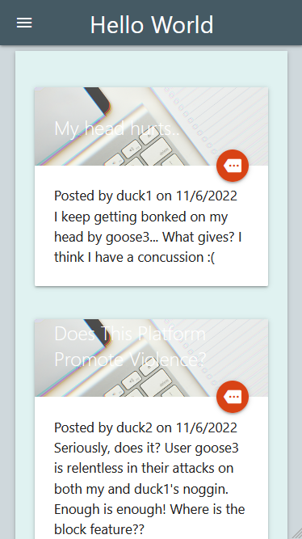

# Handlebars and Express with mySQL Blog Demo  
[](https://www.gnu.org/licenses/old-licenses/gpl-2.0.en.html)  
## Description  
This is a simple app exploring the core functionality of the handlebars view engine. It allows users to sign up or log in; create, view, and delete posts; as well as comment on individual posts.  

## Deployed Link

[Delployed with Heroku and JawsDB](https://handlebars-tech-blog-demo.herokuapp.com/)

## Screenshot 



## Table of Contents  
* [Details](#details)  
       * [Technologies](#technologies)  
* [Installation](#installation)  
* [Usage](#usage)  
* [Contributing](#contributing)  
* [Questions](#questions)  
* [Credits](#credits)  
----  
## Details  
### Technologies  
Express + mySQL (mysql2) along with JawsDB for the server and DB. Handlebars as a view engine, and Materialize for styling. Node is used as the engine.  
  
## Installation  
Clone the repo locally, and navigate to the root of the directory in your terminal. Use ```npm i``` to install the packages needed.   
## Usage  
In the root of the directory, run mySQL and ```SOURCE db/schema.sql`` to seed, run ```npm seed``` after database creation. Finally, change the enviroment variables to allow local hosting, and run ```npm start```.  
  
----  
  ## Contributing  
Feel free to fork the repo and submit pull requests.  
## Questions  
  
>Got questions? Reach out to me at:  
>My [Github](https://github.com/JaquelRey)  
>Email: [jaquelrey@gmail.com](mailto:jaquelrey@gmail.com)  
  
----  
  ## Credits  
### Authors  
JR  
### Resources  
Materialize docs, countless StackOverflow posts, w3Schools, Heroku and JawsDB docs, MDN, and countless others.  
